# PQTS - Protheus Quant Trading System

[](https://www.python.org/downloads/)
[](https://github.com/jakerslam/pqts/actions/workflows/ci.yml)
[](https://github.com/jakerslam/pqts/actions/workflows/coverage.yml)
[](https://github.com/jakerslam/pqts/actions/workflows/publish-leaderboard.yml)
[](https://github.com/jakerslam/pqts/actions/workflows/release.yml)
[](https://pypi.org/project/pqts/)
[](LICENSE)
[]()

> A professional-grade algorithmic trading platform for crypto, equities, and forex markets.

## 🚀 Features

- **Multi-Market Support**: Trade crypto, stocks, and forex from one platform
- **10 Strategy Channels**: Scalping, arbitrage, trend following, mean reversion, ML, volume profile, regime detection, order flow, liquidity sweeps, multi-timeframe
- **Universal Indicators**: Technical analysis that works across all markets
- **Risk Management**: Institutional-grade position sizing (Kelly criterion) and drawdown controls
- **Machine Learning**: Ensemble models with online learning
- **Backtesting Framework**: Event-driven backtesting with realistic execution
- **Real-time Dashboard**: Live P&L and performance metrics
- **Paper Trading**: Test risk-free before going live
- **Telegram/Discord Alerts**: Incident, kill-switch, and daily PnL notification hooks

## 🏆 Why PQTS

PQTS is built for operational robustness first, not just strategy scripts.

| Capability | PQTS | Freqtrade | NautilusTrader | Hummingbot |
|------------|------|-----------|----------------|------------|
| Institutional-style risk gates | ✅ Native | ⚠️ Partial | ✅ Strong | ⚠️ Partial |
| Reconciliation + incident telemetry | ✅ Native | ⚠️ Limited | ⚠️ Depends on setup | ⚠️ Limited |
| Promotion/canary controls | ✅ Native | ❌ No first-class flow | ⚠️ Custom | ❌ No first-class flow |
| Simulation leaderboard + reporting | ✅ Native | ⚠️ Backtesting focus | ✅ Strong backtesting | ⚠️ Bot metrics focus |
| Multi-market scope (crypto/equities/forex) | ✅ | ⚠️ Primarily crypto | ✅ | ⚠️ Primarily crypto/market-making |

## 🖼️ Visual Tour

### Screenshots

| Dashboard Overview | Simulation Leaderboard |
| --- | --- |
| 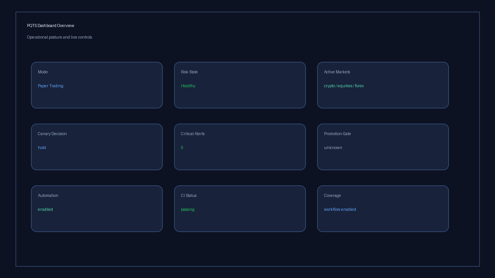 | 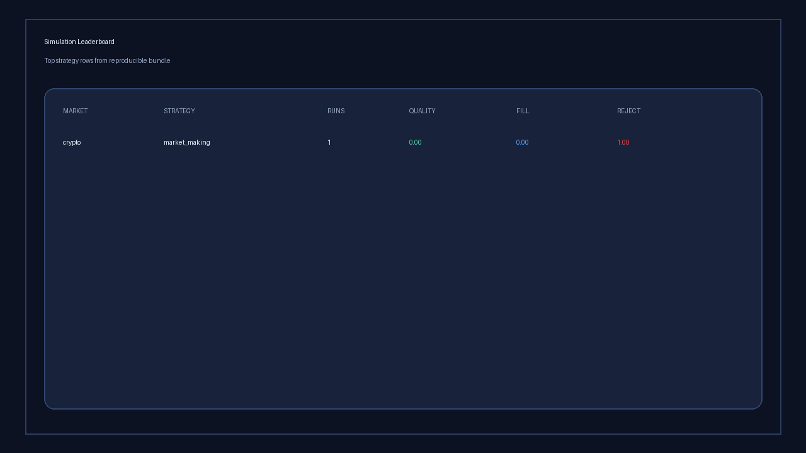 |

| Risk Controls | Canary Progress |
| --- | --- |
| 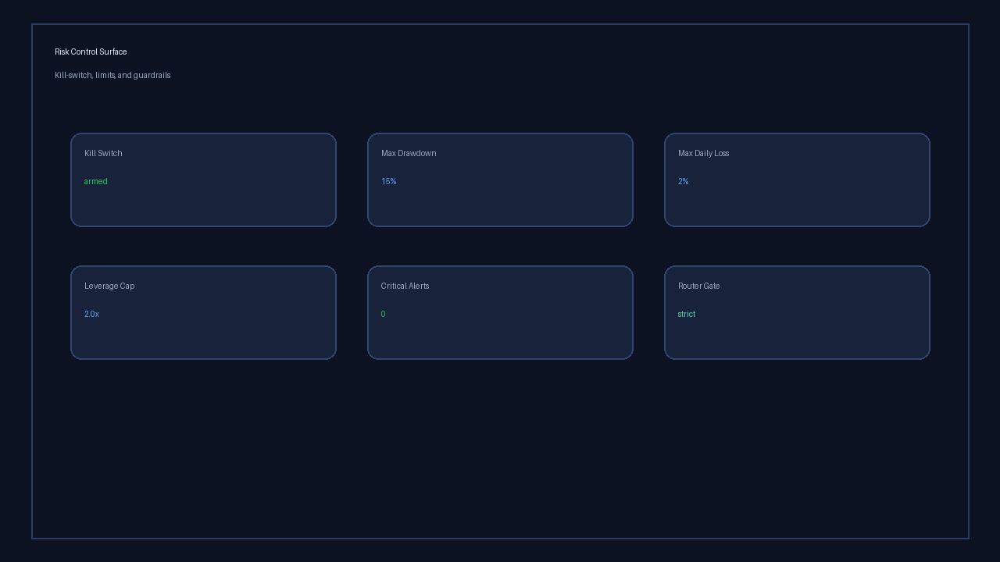 | 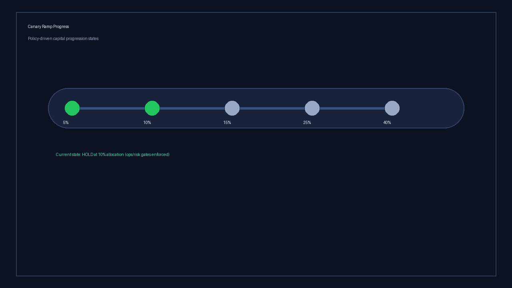 |

| Ops Health | Execution Pipeline |
| --- | --- |
| 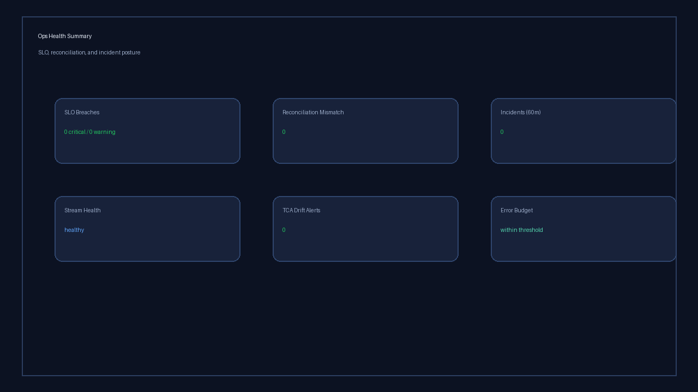 | 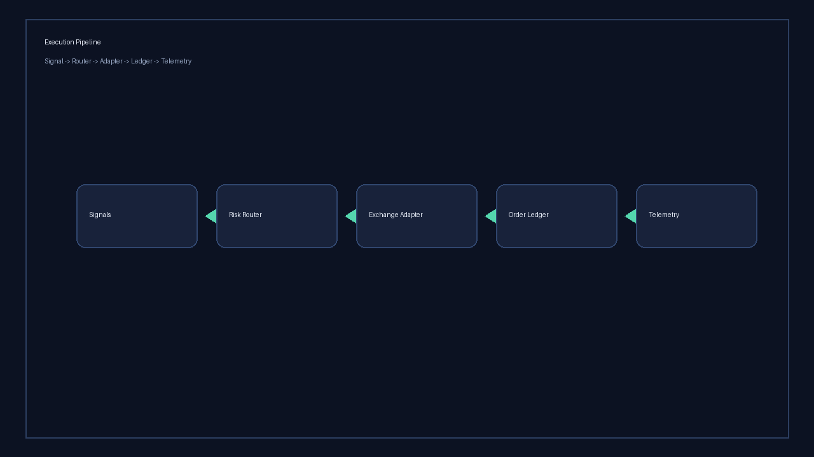 |

| Architecture Layers | Performance Snapshot |
| --- | --- |
| 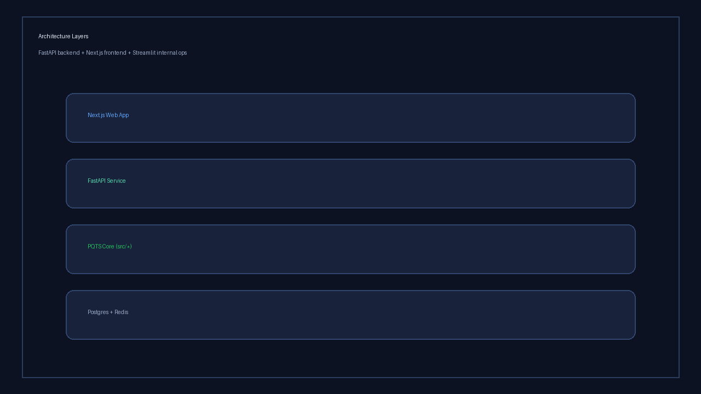 | 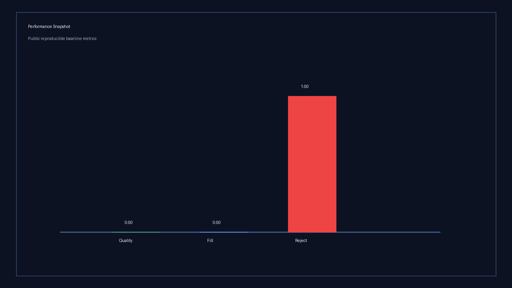 |

### GIF Previews

| Dashboard Pulse | Leaderboard Cycle | Risk Alert Flash |
| --- | --- | --- |
| 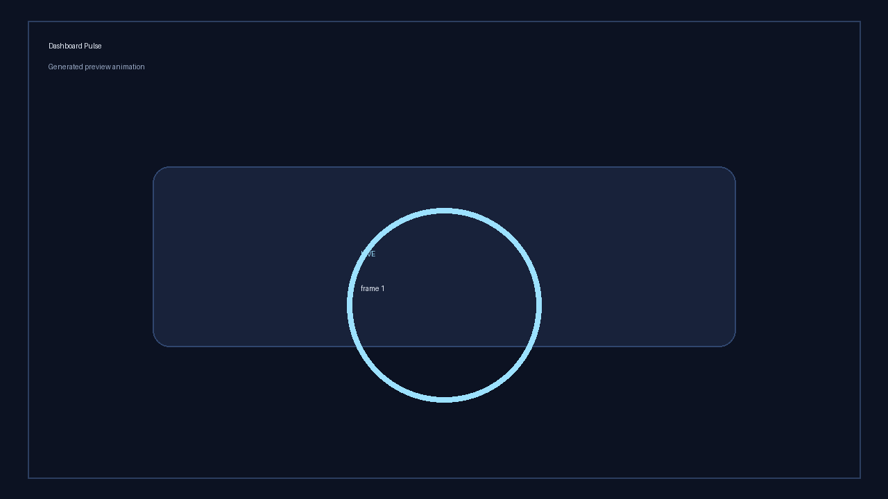 | 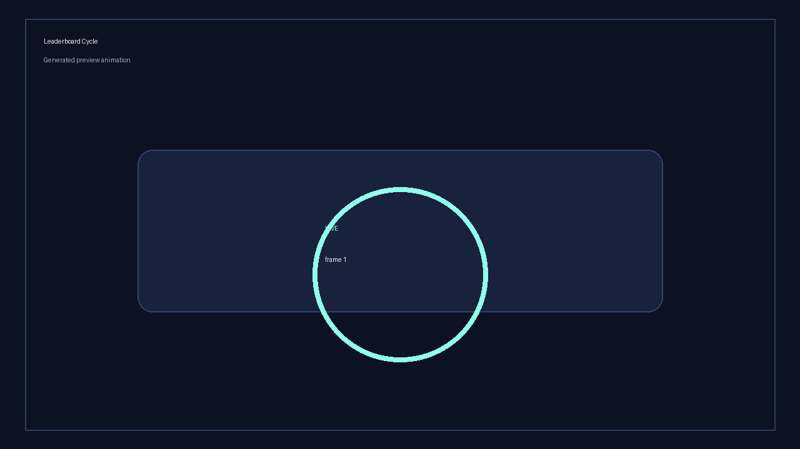 | 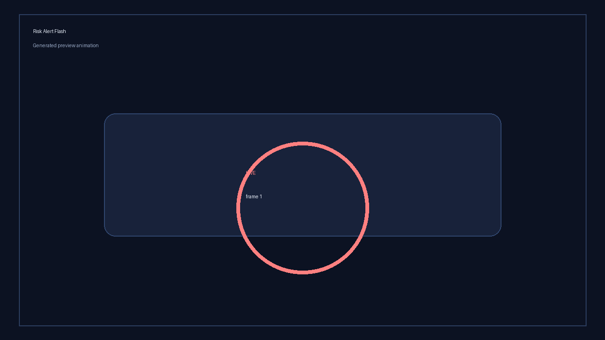 |

Regenerate media assets with:

```bash
python scripts/generate_readme_media.py
```

## 📊 Quick Start

```bash
# Clone and setup
git clone https://github.com/jakerslam/pqts.git
cd pqts

# Recommended: bootstrap local venv + dependencies
make setup
source .venv/bin/activate
# Optional strict lock install:
# make setup-lock

# Copy environment template
cp .env.example .env
# Edit .env with your API keys

# Start dashboard
python src/dashboard/start.py

# Optional package install once published:
# pip install pqts

# Run paper trading
python main.py config/paper.yaml
# or enforce a specific user risk tolerance profile:
python main.py config/paper.yaml --risk-profile conservative
# or run AI autopilot with human strategy overrides:
python main.py config/paper.yaml \
  --autopilot-mode auto \
  --autopilot-include mean_reversion \
  --autopilot-exclude ml
```

## 🐳 Docker Compose

One-command local stack (app + dashboard + Redis + Postgres, optional Grafana profile):

```bash
docker compose up --build
# optional observability profile:
# docker compose --profile observability up --build
```

Dashboard: `http://localhost:8501`  
Grafana (optional): `http://localhost:3000` (`admin` / `admin`)
Docs site (GitHub Pages): `https://jakerslam.github.io/pqts/`

## 📋 Deployment Considerations

When deploying Protheus to production-like environments:

- **Environment Variables**: Always copy `.env.example` to `.env` and populate with production credentials
- **Configuration Files**: Start with `config/paper.yaml` for testing, then modify for live trading with appropriate risk limits
- **Data Directories**: Ensure `data/` and `logs/` directories have sufficient disk space and appropriate backups
- **Port Configuration**: The dashboard defaults to port 8050; ensure this is exposed appropriately in your environment
- **Secret Management**: Use a secrets manager (AWS Secrets Manager, Vault, etc.) rather than storing credentials in config files for production

## ⚡ One-Command Demo

```bash
make demo
# or:
python apps/demo.py --market crypto --strat ml-ensemble --source x_launch_thread
# optional:
# python apps/demo.py --market crypto --risk-profile aggressive
```

The demo runs a deterministic paper-simulation slice, emits:

- a markdown demo report in `data/reports/`
- a Protheus handoff blob for agent-pilot workflows
- an attribution event row in `data/analytics/attribution_events.jsonl`

Preset launch paths:

```bash
python apps/demo.py --preset casual --source quickstart
python apps/demo.py --preset pro --source quant_desk --track-upgrade-intent
python scripts/funnel_report.py
```

First-success template flows (code-visible artifacts + diffs):

```bash
pqts backtest momentum
pqts paper start
```

These commands now emit template artifacts and config diffs under the selected output directory:

- `template_run_<timestamp>.json`
- `template_run_diff_<timestamp>.diff`

Skill package discovery + install URL export:

```bash
pqts skills list
pqts skills urls
```

Nightly bounded review + tuning proposals:

```bash
python3 scripts/run_nightly_strategy_review.py --snapshot auto
# optional: write override patch
python3 scripts/run_nightly_strategy_review.py --snapshot auto --write-overrides data/reports/nightly_review/overrides.yaml
# make target
make nightly-review
```

The nightly review also writes standardized autonomous artifacts under `data/analytics/autonomous/`:
`memory.jsonl`, `trade_journal.jsonl`, and `judge_report.jsonl`.

Ops certification + retention:

```bash
python scripts/run_exchange_certification.py --venues binance,coinbase,alpaca,oanda
python scripts/enforce_data_retention.py --root data --max-age-days 365 --max-total-files 10000
```

Six-month paper-trading harness (monthly slices + aggregate report):

```bash
python3 scripts/run_paper_6m_harness.py --months 6 --cycles-per-month 12 --sleep-seconds 0
# or:
make paper-6m
```

Artifacts are written under `data/reports/paper_6m/`, including one consolidated
`paper_6m_harness_<timestamp>.json` report.

World-class ops checklist (all 10 steps, one command):

```bash
python scripts/run_world_class_ops.py --config config/paper.yaml --quick
```

Governance and contract gates (recommended before PR/release):

```bash
make governance-check
```

Live secret validation:

```bash
python scripts/validate_live_secrets.py --config config/live_canary.yaml --strict
```

FastAPI SSE stream surface (authenticated):

```bash
curl -N \
  -H "Authorization: Bearer <viewer-token>" \
  "http://localhost:8000/v1/stream/sse/orders?account_id=paper-main"
```

Deployment run-mode entrypoint (environment-driven):

```bash
PQTS_RUN_MODE=engine python3 scripts/run_mode_entrypoint.py --print-plan
PQTS_RUN_MODE=api PQTS_API_TOKENS="viewer-token:viewer" python3 scripts/run_mode_entrypoint.py --print-plan
PQTS_RUN_MODE=stream python3 scripts/run_mode_entrypoint.py --print-plan
```

PnL truth ledger + strategy auto-disable list:

```bash
python scripts/pnl_truth_ledger_report.py \
  --tca-db data/tca_records.csv \
  --lookback-days 30 \
  --min-trades 50 \
  --disable-threshold-net-alpha-usd 0 \
  --strict
```

## 🧪 Simulation Suite + Telemetry

Run multi-market, multi-strategy simulation suites and emit optimization telemetry:

```bash
make sim-suite
# or:
python scripts/run_simulation_suite.py \
  --markets crypto,equities,forex \
  --strategies market_making,funding_arbitrage,cross_exchange \
  --cycles-per-scenario 60 \
  --readiness-every 20 \
  --risk-profile balanced
```

Artifacts:

- suite report JSON: `data/reports/simulation_suite_<timestamp>.json`
- optimization leaderboard CSV: `data/reports/simulation_leaderboard_<timestamp>.csv`
- event telemetry log: `data/analytics/simulation_events.jsonl`

The dashboard now renders this telemetry in a dedicated **Simulation Leaderboard** panel.

Static leaderboard export (for GitHub Pages):

```bash
python scripts/export_simulation_leaderboard_site.py --reports-dir data/reports --output-dir site
```

Or publish docs + leaderboard via GitHub Actions:

```bash
gh workflow run "Publish Docs Site"
```

## 📂 Published Results

Public reproducible result bundles live under `results/`.

- baseline bundle: `results/2026-03-09_sim_suite_baseline/`
- additional bundles:
  - `results/2026-03-09_crypto_market_making_short/`
  - `results/2026-03-09_crypto_funding_arbitrage_short/`
  - `results/2026-03-09_multi_market_market_making_short/`
- bundle schema/template: `results/RESULT_TEMPLATE.md`

Each bundle includes the command, inputs, key metrics, and chart artifacts.

## 🔔 Notifications (Telegram/Discord)

Incident automation can dispatch notifications directly:

```bash
python scripts/run_incident_automation.py \
  --discord-webhook-url "$PQTS_DISCORD_WEBHOOK_URL" \
  --telegram-bot-token "$PQTS_TELEGRAM_BOT_TOKEN" \
  --telegram-chat-id "$PQTS_TELEGRAM_CHAT_ID"
```

For direct/manual alerts:

```bash
python scripts/send_ops_notification.py --mode raw --message "PQTS heartbeat"
```

Execution drift report:

```bash
python scripts/execution_drift_report.py --tca-db data/tca_records.csv --lookback-days 30
```

Shadow parity + operational SLO flow:

```bash
# 1) Collect market/order/fill parity telemetry
python scripts/run_shadow_stream_worker.py --cycles 30 --sleep-seconds 1.0

# 2) Reconcile internal vs venue state (auto-halt on mismatch)
python scripts/run_reconciliation_daemon.py --cycles 12 --sleep-seconds 5.0 --halt-on-mismatch

# 3) Evaluate SLO health + route alerts
python scripts/slo_health_report.py

# 4) Weekly error-budget review
python scripts/weekly_error_budget_review.py --window-days 7
```

Additional artifacts:

- `data/analytics/shadow_stream_events.jsonl`
- `data/analytics/stream_health.json`
- `data/analytics/reconciliation_incidents.jsonl`
- `data/alerts/slo_alerts.jsonl`
- `data/reports/slo_health_<timestamp>.json`
- `data/reports/error_budget_review_<timestamp>.json`

Execution truth + promotion + canary ramp flow:

```bash
# 1) websocket market/order/fill ingestion
python scripts/run_ws_ingestion.py --cycles 30 --sleep-seconds 1.0

# 2) strategy tournament from partitioned data lake
python scripts/run_strategy_tournament.py \
  --start 2026-01-01T00:00:00Z \
  --end 2026-02-01T00:00:00Z \
  --sources binance:BTCUSDT,binance:ETHUSDT \
  --strategy-types market_making,funding_arbitrage

# 3) policy-driven canary allocation step (advance/hold/rollback/halt)
python scripts/run_canary_ramp.py

# 4) B2B control-plane usage + pricing readout
python scripts/control_plane_report.py
```

## 🎛️ Dashboard

Launch the real-time dashboard:
```bash
python src/dashboard/start.py
```

Access at `http://localhost:8501`

## 📈 Strategy Performance

| Strategy | Timeframe | Edge |
|----------|-----------|------|
| Scalping | 1m, 5m | Microstructure, order flow |
| Arbitrage | Real-time | Cross-exchange, funding rates |
| Trend Following | 1h, 4h | Momentum + multi-timeframe |
| Mean Reversion | 15m, 1h | RSI, Bollinger, Volume Profile |
| ML Ensemble | Variable | Random Forest, XGBoost, LSTM |
| Volume Profile | 1h, 4h | POC, Value Area, HVN |
| Order Flow | Tick | Delta, whale detection |
| Liquidity Sweep | 15m, 1h | Stop hunts, false breakouts |

## 🧠 Architecture

PQTS now uses a canonical **modular monolith** layout:

- `src/app/`: composition root and runtime entrypoints
- `src/contracts/`: module and event contracts
- `src/modules/`: module descriptors and lifecycle hooks
- `src/adapters/`: external I/O adapter descriptors/loaders

Legacy packages (`src/core/`, `src/execution/`, `src/analytics/`, `src/risk/`, `src/strategies/`, etc.) remain active during migration and are wired through `src/app/`.

Architecture tooling:

```bash
python tools/check_architecture_boundaries.py
python tools/print_architecture_map.py
python tools/scaffold_module.py order_intelligence --requires data,signals --provides flow_signals
```

Detailed rules and migration notes: `docs/ARCHITECTURE.md`

Repository layout guide: `docs/REPO_STRUCTURE.md`

## 📚 Documentation

- [Architecture](docs/ARCHITECTURE.md)
- [Repository Structure](docs/REPO_STRUCTURE.md)
- [Codex Compliance](docs/CODEX_COMPLIANCE.md)
- [Implementation Direction](docs/IMPLEMENTATION_DIRECTION.md)
- [SRS](docs/SRS.md)
- [SRS Coverage Matrix](docs/SRS_COVERAGE_MATRIX.md)
- [SRS Gap Backlog](docs/SRS_GAP_BACKLOG.md)
- [Development Summary](docs/DEVELOPMENT_SUMMARY.md)
- [Native Hotpath](docs/NATIVE_HOTPATH.md)
- [Live Money Roadmap](docs/ROADMAP_LIVE_MONEY.md)
- [System Overview](docs/OVERVIEW.md)
- [World-Class Execution Pack](docs/WORLD_CLASS_EXECUTION_PACK.md)
- [Backtesting Guide](docs/BACKTESTING.md)
- [Simulation Telemetry](docs/SIMULATION_TELEMETRY.md)
- [World-Class 30/60/90 Plan](docs/WORLD_CLASS_30_60_90.md)
- [World-Class Next Steps Execution](docs/WORLD_CLASS_NEXT_STEPS_EXECUTION.md)
- [Max Utility + Revenue Playbook](docs/MAX_UTILITY_REVENUE_PLAYBOOK.md)
- [Strategy Patterns](docs/ADVANCED_PATTERNS.md)
- [Incident Runbook](docs/INCIDENT_RUNBOOK.md)
- [Pricing And Packaging](docs/PRICING_AND_PACKAGING.md)
- [GTM 90-Day Plan](docs/GTM_90_DAY_PLAN.md)
- [Self-Serve Signup Spec](docs/SELF_SERVE_SIGNUP_SPEC.md)
- [Protheus Toybox Launch](docs/PROTHEUS_TOYBOX.md)
- [X Thread Template](docs/X_THREAD_TEMPLATE.md)
- [Engineering TODO](docs/TODO.md)
- [Humans-Only Work](docs/HUMANS_ONLY.md)
- [5-Minute Quickstart](docs/QUICKSTART_5_MIN.md)
- [Architecture Diagram](docs/ARCHITECTURE_DIAGRAM.md)
- [Benchmarks](docs/BENCHMARKS.md)
- [Release Checklist](docs/RELEASE_CHECKLIST.md)
- [Branch Protection Guidance](docs/BRANCH_PROTECTION.md)
- [PyPI Publishing Setup](docs/PYPI_PUBLISHING.md)
- [Reproducible Results Bundle Guide](results/README.md)

## 🤝 Project Governance

- [Contributing Guide](.github/CONTRIBUTING.md)
- [Code of Conduct](.github/CODE_OF_CONDUCT.md)
- [Security Policy](.github/SECURITY.md)
- [Support](.github/SUPPORT.md)
- [Changelog](CHANGELOG.md)
- [Citation](CITATION.cff)

## 📦 Releases

- Create a semantic version tag (for example `v0.1.1`) to trigger release + PyPI publish workflow.
- Release notes are generated automatically in GitHub Releases.

## 🛠️ Configuration

### Paper Trading
```yaml
mode: paper_trading
markets:
  crypto:
    enabled: true
    exchanges:
      - name: binance
        api_key: ${BINANCE_TESTNET_API_KEY}
        api_secret: ${BINANCE_TESTNET_API_SECRET}
        testnet: true
```

### Live Trading
```yaml
mode: live
markets:
  crypto:
    enabled: true
    exchanges:
      - name: binance
        testnet: false
        api_key: ${BINANCE_API_KEY}
        api_secret: ${BINANCE_API_SECRET}
execution:
  require_live_client_order_id: true
  idempotency_ttl_seconds: 300.0
  strategy_disable_list_path: data/analytics/strategy_disable_list.json
  allocation_controls:
    enabled: true
    default_max_strategy_allocation_pct: 0.25
    default_max_venue_allocation_pct: 0.50
  rate_limits:
    binance:
      order_create:
        limit: 10
        window_seconds: 1.0
      order_cancel:
        limit: 10
        window_seconds: 1.0
      market_ticker:
        limit: 50
        window_seconds: 1.0
```

## ⚠️ Risk Disclaimer

Trading involves substantial risk. Past performance doesn't guarantee future results. Always start with paper trading.
Any Sharpe/return claim should come from reproducible backtest or paper/live reports.

## 📄 License

MIT (see [LICENSE](LICENSE))

---

Built by Protheus
