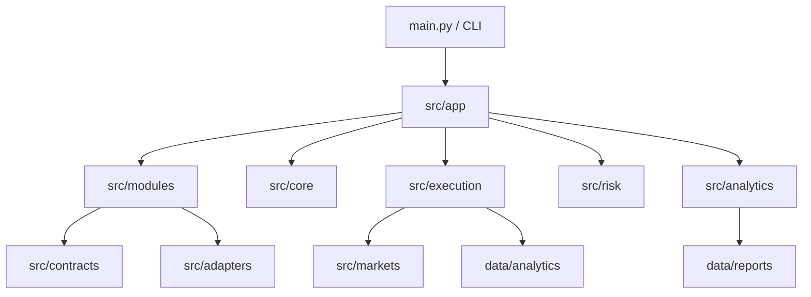

# Architecture Diagram

```mermaid
flowchart TD
    CLI["main.py / CLI"] --> APP["src/app"]
    APP --> MODULES["src/modules"]
    MODULES --> CONTRACTS["src/contracts"]
    MODULES --> ADAPTERS["src/adapters"]
    APP --> CORE["src/core"]
    APP --> EXEC["src/execution"]
    APP --> RISK["src/risk"]
    APP --> ANALYTICS["src/analytics"]
    EXEC --> MARKETS["src/markets"]
    ANALYTICS --> REPORTS["data/reports"]
    EXEC --> TELEMETRY["data/analytics"]
```

Canonical import boundaries are enforced by `tools/check_architecture_boundaries.py`.
